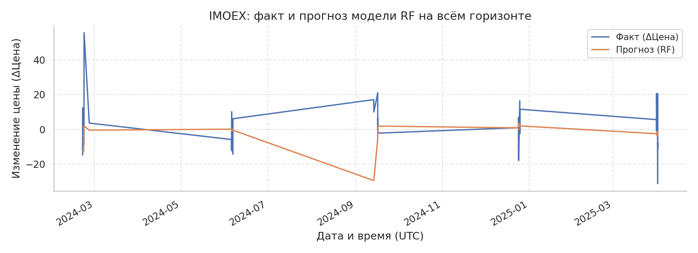
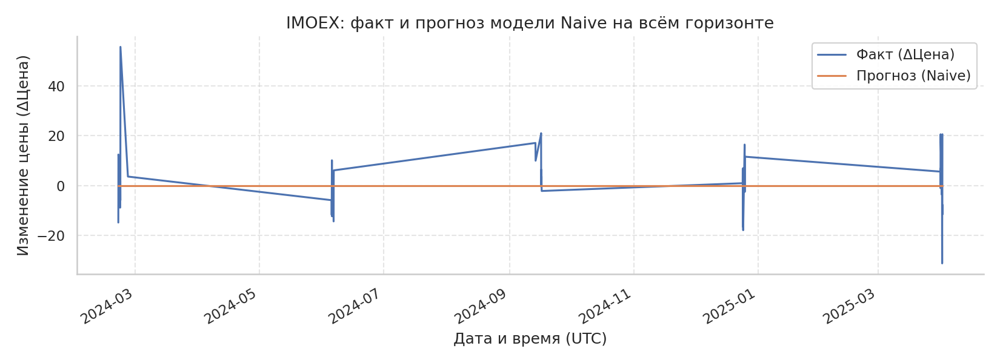
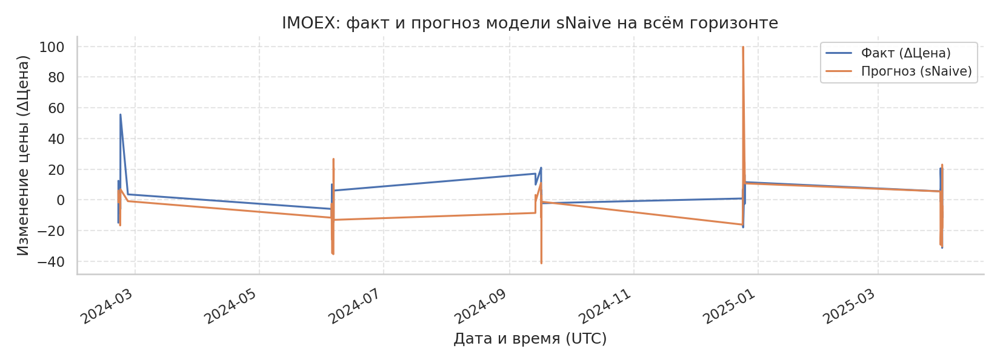
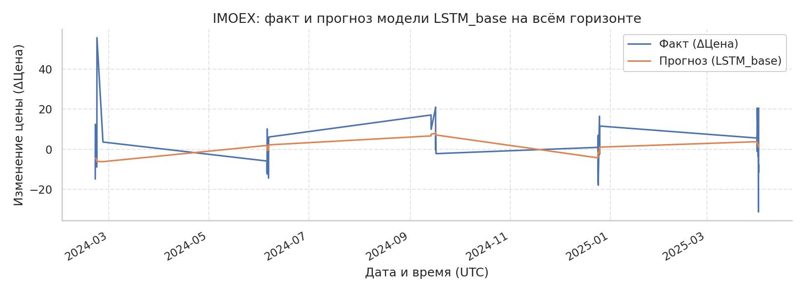

# Отчёт по моделям прогнозирования (почасовые данные)

Версия: автогенерация из артефактов в папке outputs.

## Методология без утечек для IMOEX

Прогнозируем почасовой ряд индекса IMOEX, добавляя экзогенные факторы только в виде лагов. Используемые формулы:

$$r_t = \mu + \beta^\top X_{t-1} + \varepsilon_t, \qquad \sigma_t^2 = \omega + \alpha \varepsilon_{t-1}^2 + \beta \sigma_{t-1}^2 + \gamma^\top X_{t-1}.$$

Вектор $X_{t-1}$ содержит лаги Brent, USD/RUB, ключевой ставки, RSI(50), ATR(50) и лаги цены. Параметры CatBoost/RF и LSTM обучаются только на стандартизованных лаговых матрицах; гибридная LSTM использует прогноз SARIMAX и σ_t из GARCH как признаки риска. Ни один признак не знает будущего, эмбарго и walk-forward разбиения исключают утечки.

## Матрица признаков (Y и Xi)

```
Y=dClose | X1=Value | X2=SMA_5 | X3=SMA_10 | X4=SMA_20 | X5=EMA_5 | X6=EMA_10 | X7=EMA_20 | X8=BBH | X9=BBL | X10=RSI_50 | X11=StochK | X12=StochD | X13=ATR_50 | X14=OBV | X15=MACD | X16=MACD_SIGNAL | X17=MACD_DIFF | X18=ADX_14 | X19=CCI_20 | X20=ROC_10 | X21=WILLR_14 | X22=lag1 | X23=lag2 | X24=lag3 | X25=lag4 | X26=lag5 | X27=lag6 | X28=lag7 | X29=lag8 | X30=lag9 | X31=lag10 | X32=lag11 | X33=lag12 | X34=lag13 | X35=lag14 | X36=lag15 | X37=lag16 | X38=lag17 | X39=lag18 | X40=lag19 | X41=lag20 | X42=lag21 | X43=lag22 | X44=lag23 | X45=lag24 | X46=lag25 | X47=lag26 | X48=lag27 | X49=lag28 | X50=lag29 | X51=lag30 | X52=lag31 | X53=lag32 | X54=lag33 | X55=lag34 | X56=lag35 | X57=lag36 | X58=lag37 | X59=lag38 | X60=lag39 | X61=lag40 | X62=lag41 | X63=lag42 | X64=lag43 | X65=lag44 | X66=lag45 | X67=lag46 | X68=lag47 | X69=lag48 | X70=lag49 | X71=lag50 | X72=lag51 | X73=lag52 | X74=lag53 | X75=lag54 | X76=lag55 | X77=lag56 | X78=lag57 | X79=lag58 | X80=lag59 | X81=lag60 | X82=Brent_lag1 | X83=Brent_lag2 | X84=Brent_lag3 | X85=Brent_lag4 | X86=Brent_lag5 | X87=Brent_lag6 | X88=Brent_lag7 | X89=Brent_lag8 | X90=Brent_lag9 | X91=Brent_lag10 | X92=Brent_lag11 | X93=Brent_lag12 | X94=Brent_lag13 | X95=Brent_lag14 | X96=Brent_lag15 | X97=Brent_lag16 | X98=Brent_lag17 | X99=Brent_lag18 | X100=Brent_lag19 | X101=Brent_lag20 | X102=Brent_lag21 | X103=Brent_lag22 | X104=Brent_lag23 | X105=Brent_lag24 | X106=USD_lag1 | X107=USD_lag2 | X108=USD_lag3 | X109=USD_lag4 | X110=USD_lag5 | X111=USD_lag6 | X112=USD_lag7 | X113=USD_lag8 | X114=USD_lag9 | X115=USD_lag10 | X116=USD_lag11 | X117=USD_lag12 | X118=USD_lag13 | X119=USD_lag14 | X120=USD_lag15 | X121=USD_lag16 | X122=USD_lag17 | X123=USD_lag18 | X124=USD_lag19 | X125=USD_lag20 | X126=USD_lag21 | X127=USD_lag22 | X128=USD_lag23 | X129=USD_lag24 | X130=KeyRate_lag1 | X131=KeyRate_lag2 | X132=KeyRate_lag3 | X133=KeyRate_lag4 | X134=KeyRate_lag5 | X135=KeyRate_lag6 | X136=KeyRate_lag7 | X137=KeyRate_lag8 | X138=KeyRate_lag9 | X139=KeyRate_lag10 | X140=KeyRate_lag11 | X141=KeyRate_lag12 | X142=KeyRate_lag13 | X143=KeyRate_lag14 | X144=KeyRate_lag15 | X145=KeyRate_lag16 | X146=KeyRate_lag17 | X147=KeyRate_lag18 | X148=KeyRate_lag19 | X149=KeyRate_lag20 | X150=KeyRate_lag21 | X151=KeyRate_lag22 | X152=KeyRate_lag23 | X153=KeyRate_lag24
```

## Сводные метрики по тикерам и моделям

```
   Tk     Model       MAE      RMSE       MAPE       WAPE      sMAPE      MdAPE     MASE    CumRet    MaxDD
IMOEX  LSTM_att  9.457418 12.391095 207.248238  98.771579 153.366089  98.835238 0.626636  0.003496 0.013247
IMOEX     Naive  9.578500 12.703207 100.000000 100.000000 199.999999 100.000000 0.643684  0.000000 0.000000
IMOEX  CatBoost  9.599612 12.753863 126.677532 100.077486 166.540338 100.752509 0.639680 -0.012896 0.023496
IMOEX LSTM_base  9.746921 12.569763 267.180954 101.152489 147.640001 106.834704 0.657667 -0.002041 0.015583
IMOEX    Hybrid  9.971901 13.131557 117.954836 103.735900 166.832929 109.857873 0.670535 -0.014525 0.021449
IMOEX   SARIMAX 11.260173 14.362702 293.498303 118.264634 152.479404 121.231005 0.793228 -0.028284 0.031119
IMOEX        RF 11.530023 15.404902 147.550562 122.377891 164.575756 114.501517 0.804929 -0.007563 0.021737
IMOEX    sNaive 16.075167 23.571650 480.707501 174.719587 139.240593 155.218008 1.000000 -0.018469 0.025087
```

## Лучшие модели по MAE на тикер

```
   Tk    Model      MAE      RMSE       MAPE      WAPE      sMAPE     MdAPE     MASE   CumRet    MaxDD
IMOEX LSTM_att 9.457418 12.391095 207.248238 98.771579 153.366089 98.835238 0.626636 0.003496 0.013247
```

## Лучшие модели по WAPE на тикер

```
   Tk    Model      MAE      RMSE       MAPE      WAPE      sMAPE     MdAPE     MASE   CumRet    MaxDD
IMOEX LSTM_att 9.457418 12.391095 207.248238 98.771579 153.366089 98.835238 0.626636 0.003496 0.013247
```

## Попарные DM-тесты по метрикам

```
   Tk    Model1    Model2 Metric   DM_stat        p_val
IMOEX  LSTM_att    sNaive    MAE -3.027834 2.463133e-03
IMOEX     Naive    sNaive    MAE -2.991199 2.778841e-03
IMOEX  CatBoost    sNaive    MAE -2.856929 4.277616e-03
IMOEX LSTM_base    sNaive    MAE -2.841284 4.493229e-03
IMOEX    Hybrid    sNaive    MAE -2.743829 6.072709e-03
IMOEX     Naive   SARIMAX    MAE -2.353894 1.857793e-02
IMOEX  CatBoost   SARIMAX    MAE -2.231029 2.567919e-02
IMOEX  LSTM_att   SARIMAX    MAE -2.186238 2.879817e-02
IMOEX     Naive        RF    MAE -2.065803 3.884706e-02
IMOEX   SARIMAX    sNaive    MAE -2.059953 3.940299e-02
IMOEX        RF    sNaive    MAE -1.900373 5.738416e-02
IMOEX  CatBoost        RF    MAE -1.770374 7.666483e-02
IMOEX  LSTM_att        RF    MAE -1.742983 8.133657e-02
IMOEX LSTM_base   SARIMAX    MAE -1.672403 9.444488e-02
IMOEX    Hybrid        RF    MAE -1.610389 1.073130e-01
IMOEX LSTM_base        RF    MAE -1.464243 1.431274e-01
IMOEX    Hybrid   SARIMAX    MAE -1.457393 1.450078e-01
IMOEX    Hybrid     Naive    MAE  1.058138 2.899925e-01
IMOEX    Hybrid  LSTM_att    MAE  0.889034 3.739847e-01
IMOEX  CatBoost    Hybrid    MAE -0.768088 4.424347e-01
IMOEX  LSTM_att LSTM_base    MAE -0.642126 5.207913e-01
IMOEX    Hybrid LSTM_base    MAE  0.334795 7.377800e-01
IMOEX  CatBoost  LSTM_att    MAE  0.321963 7.474810e-01
IMOEX LSTM_base     Naive    MAE  0.311020 7.557855e-01
IMOEX  LSTM_att     Naive    MAE -0.308523 7.576847e-01
IMOEX  CatBoost LSTM_base    MAE -0.302853 7.620017e-01
IMOEX        RF   SARIMAX    MAE  0.228712 8.190931e-01
IMOEX  CatBoost     Naive    MAE  0.072330 9.423391e-01
IMOEX  LSTM_att LSTM_base   MAPE -2.506658 1.218786e-02
IMOEX     Naive        RF   MAPE -2.365012 1.802951e-02
IMOEX LSTM_base     Naive   MAPE  2.049461 4.041701e-02
IMOEX  CatBoost     Naive   MAPE  1.943226 5.198885e-02
IMOEX  CatBoost LSTM_base   MAPE -1.918647 5.502908e-02
IMOEX    Hybrid LSTM_base   MAPE -1.822635 6.835873e-02
IMOEX  LSTM_att     Naive   MAPE  1.746471 8.072906e-02
IMOEX     Naive   SARIMAX   MAPE -1.741076 8.167030e-02
IMOEX     Naive    sNaive   MAPE -1.721360 8.518543e-02
IMOEX LSTM_base        RF   MAPE  1.657976 9.732237e-02
IMOEX  CatBoost    sNaive   MAPE -1.641050 1.007870e-01
IMOEX    Hybrid    sNaive   MAPE -1.626711 1.037986e-01
IMOEX  CatBoost   SARIMAX   MAPE -1.578913 1.143559e-01
IMOEX    Hybrid   SARIMAX   MAPE -1.570084 1.163957e-01
IMOEX    Hybrid     Naive   MAPE  1.551141 1.208678e-01
IMOEX        RF    sNaive   MAPE -1.506582 1.319178e-01
IMOEX        RF   SARIMAX   MAPE -1.506273 1.319970e-01
IMOEX  CatBoost  LSTM_att   MAPE -1.479076 1.391201e-01
IMOEX    Hybrid  LSTM_att   MAPE -1.434419 1.514528e-01
IMOEX  LSTM_att    sNaive   MAPE -1.399423 1.616861e-01
IMOEX    Hybrid        RF   MAPE -1.281326 2.000790e-01
IMOEX  LSTM_att   SARIMAX   MAPE -1.266505 2.053323e-01
IMOEX LSTM_base    sNaive   MAPE -1.141899 2.534959e-01
IMOEX  LSTM_att        RF   MAPE  1.140537 2.540624e-01
IMOEX  CatBoost        RF   MAPE -0.909128 3.632826e-01
IMOEX   SARIMAX    sNaive   MAPE -0.788024 4.306828e-01
IMOEX  CatBoost    Hybrid   MAPE  0.468429 6.394776e-01
IMOEX LSTM_base   SARIMAX   MAPE -0.410797 6.812215e-01
IMOEX  LSTM_att LSTM_base  MDAPE -2.506658 1.218786e-02
IMOEX     Naive        RF  MDAPE -2.365012 1.802951e-02
IMOEX LSTM_base     Naive  MDAPE  2.049461 4.041701e-02
IMOEX  CatBoost     Naive  MDAPE  1.943226 5.198885e-02
IMOEX  CatBoost LSTM_base  MDAPE -1.918647 5.502908e-02
IMOEX    Hybrid LSTM_base  MDAPE -1.822635 6.835873e-02
IMOEX  LSTM_att     Naive  MDAPE  1.746471 8.072906e-02
IMOEX     Naive   SARIMAX  MDAPE -1.741076 8.167030e-02
IMOEX     Naive    sNaive  MDAPE -1.721360 8.518543e-02
IMOEX LSTM_base        RF  MDAPE  1.657976 9.732237e-02
IMOEX  CatBoost    sNaive  MDAPE -1.641050 1.007870e-01
IMOEX    Hybrid    sNaive  MDAPE -1.626711 1.037986e-01
IMOEX  CatBoost   SARIMAX  MDAPE -1.578913 1.143559e-01
IMOEX    Hybrid   SARIMAX  MDAPE -1.570084 1.163957e-01
IMOEX    Hybrid     Naive  MDAPE  1.551141 1.208678e-01
IMOEX        RF    sNaive  MDAPE -1.506582 1.319178e-01
IMOEX        RF   SARIMAX  MDAPE -1.506273 1.319970e-01
IMOEX  CatBoost  LSTM_att  MDAPE -1.479076 1.391201e-01
IMOEX    Hybrid  LSTM_att  MDAPE -1.434419 1.514528e-01
IMOEX  LSTM_att    sNaive  MDAPE -1.399423 1.616861e-01
IMOEX    Hybrid        RF  MDAPE -1.281326 2.000790e-01
IMOEX  LSTM_att   SARIMAX  MDAPE -1.266505 2.053323e-01
IMOEX LSTM_base    sNaive  MDAPE -1.141899 2.534959e-01
IMOEX  LSTM_att        RF  MDAPE  1.140537 2.540624e-01
IMOEX  CatBoost        RF  MDAPE -0.909128 3.632826e-01
IMOEX   SARIMAX    sNaive  MDAPE -0.788024 4.306828e-01
IMOEX  CatBoost    Hybrid  MDAPE  0.468429 6.394776e-01
IMOEX LSTM_base   SARIMAX  MDAPE -0.410797 6.812215e-01
IMOEX     Naive   SARIMAX   RMSE -2.715086 6.625856e-03
IMOEX  LSTM_att   SARIMAX   RMSE -2.548249 1.082653e-02
IMOEX  CatBoost   SARIMAX   RMSE -2.430642 1.507208e-02
IMOEX     Naive        RF   RMSE -1.970288 4.880534e-02
IMOEX  LSTM_att        RF   RMSE -1.922107 5.459225e-02
IMOEX  LSTM_att    sNaive   RMSE -1.910930 5.601355e-02
IMOEX LSTM_base   SARIMAX   RMSE -1.879107 6.022988e-02
IMOEX     Naive    sNaive   RMSE -1.876644 6.056685e-02
IMOEX LSTM_base    sNaive   RMSE -1.838645 6.596746e-02
IMOEX  CatBoost    sNaive   RMSE -1.838112 6.604589e-02
IMOEX    Hybrid    sNaive   RMSE -1.819534 6.883005e-02
IMOEX  CatBoost        RF   RMSE -1.788910 7.362933e-02
IMOEX    Hybrid   SARIMAX   RMSE -1.705744 8.805570e-02
IMOEX    Hybrid        RF   RMSE -1.704252 8.833398e-02
IMOEX LSTM_base        RF   RMSE -1.619305 1.053816e-01
IMOEX   SARIMAX    sNaive   RMSE -1.612125 1.069348e-01
IMOEX        RF    sNaive   RMSE -1.423625 1.545549e-01
IMOEX    Hybrid  LSTM_att   RMSE  1.121888 2.619100e-01
IMOEX    Hybrid     Naive   RMSE  0.999713 3.174495e-01
IMOEX  LSTM_att     Naive   RMSE -0.823903 4.099949e-01
IMOEX  CatBoost  LSTM_att   RMSE  0.811660 4.169866e-01
IMOEX        RF   SARIMAX   RMSE  0.771147 4.406200e-01
IMOEX  LSTM_att LSTM_base   RMSE -0.727120 4.671523e-01
IMOEX  CatBoost    Hybrid   RMSE -0.699313 4.843565e-01
IMOEX    Hybrid LSTM_base   RMSE  0.358243 7.201614e-01
IMOEX  CatBoost     Naive   RMSE  0.328283 7.426978e-01
IMOEX LSTM_base     Naive   RMSE  0.310430 7.562337e-01
IMOEX  CatBoost LSTM_base   RMSE -0.174411 8.615424e-01
IMOEX     Naive    sNaive  SMAPE  6.651072 2.909661e-11
IMOEX LSTM_base     Naive  SMAPE -6.279886 3.388207e-10
IMOEX  CatBoost     Naive  SMAPE -5.914655 3.325710e-09
IMOEX     Naive   SARIMAX  SMAPE  5.696179 1.225225e-08
IMOEX  LSTM_att     Naive  SMAPE -5.598847 2.157826e-08
IMOEX     Naive        RF  SMAPE  4.989766 6.045247e-07
IMOEX    Hybrid     Naive  SMAPE -4.749640 2.037792e-06
IMOEX  CatBoost    sNaive  SMAPE  2.478651 1.318802e-02
IMOEX        RF    sNaive  SMAPE  2.327787 1.992344e-02
IMOEX  CatBoost LSTM_base  SMAPE  2.277117 2.277923e-02
IMOEX    Hybrid    sNaive  SMAPE  2.270543 2.317463e-02
IMOEX    Hybrid LSTM_base  SMAPE  1.784294 7.437590e-02
IMOEX  CatBoost   SARIMAX  SMAPE  1.581957 1.136593e-01
IMOEX LSTM_base        RF  SMAPE -1.478204 1.393533e-01
IMOEX  CatBoost  LSTM_att  SMAPE  1.293263 1.959201e-01
IMOEX    Hybrid   SARIMAX  SMAPE  1.197604 2.310712e-01
IMOEX    Hybrid  LSTM_att  SMAPE  1.144326 2.524884e-01
IMOEX   SARIMAX    sNaive  SMAPE  1.089734 2.758303e-01
IMOEX        RF   SARIMAX  SMAPE  1.032274 3.019439e-01
IMOEX  LSTM_att    sNaive  SMAPE  1.029786 3.031105e-01
IMOEX  LSTM_att        RF  SMAPE -0.953203 3.404874e-01
IMOEX LSTM_base    sNaive  SMAPE  0.670398 5.026042e-01
IMOEX  LSTM_att LSTM_base  SMAPE  0.619579 5.355350e-01
IMOEX LSTM_base   SARIMAX  SMAPE -0.389758 6.967152e-01
IMOEX    Hybrid        RF  SMAPE  0.269588 7.874770e-01
IMOEX  CatBoost        RF  SMAPE  0.213259 8.311252e-01
IMOEX  LSTM_att   SARIMAX  SMAPE  0.074398 9.406941e-01
IMOEX  CatBoost    Hybrid  SMAPE -0.031309 9.750232e-01
IMOEX  LSTM_att LSTM_base   WAPE -2.506658 1.218786e-02
IMOEX     Naive        RF   WAPE -2.365012 1.802951e-02
IMOEX LSTM_base     Naive   WAPE  2.049461 4.041701e-02
IMOEX  CatBoost     Naive   WAPE  1.943226 5.198885e-02
IMOEX  CatBoost LSTM_base   WAPE -1.918647 5.502908e-02
IMOEX    Hybrid LSTM_base   WAPE -1.822635 6.835873e-02
IMOEX  LSTM_att     Naive   WAPE  1.746471 8.072906e-02
IMOEX     Naive   SARIMAX   WAPE -1.741076 8.167030e-02
IMOEX     Naive    sNaive   WAPE -1.721360 8.518543e-02
IMOEX LSTM_base        RF   WAPE  1.657976 9.732237e-02
IMOEX  CatBoost    sNaive   WAPE -1.641050 1.007870e-01
IMOEX    Hybrid    sNaive   WAPE -1.626711 1.037986e-01
IMOEX  CatBoost   SARIMAX   WAPE -1.578913 1.143559e-01
IMOEX    Hybrid   SARIMAX   WAPE -1.570084 1.163957e-01
IMOEX    Hybrid     Naive   WAPE  1.551141 1.208678e-01
IMOEX        RF    sNaive   WAPE -1.506582 1.319178e-01
IMOEX        RF   SARIMAX   WAPE -1.506273 1.319970e-01
IMOEX  CatBoost  LSTM_att   WAPE -1.479076 1.391201e-01
IMOEX    Hybrid  LSTM_att   WAPE -1.434419 1.514528e-01
IMOEX  LSTM_att    sNaive   WAPE -1.399423 1.616861e-01
IMOEX    Hybrid        RF   WAPE -1.281326 2.000790e-01
IMOEX  LSTM_att   SARIMAX   WAPE -1.266505 2.053323e-01
IMOEX LSTM_base    sNaive   WAPE -1.141899 2.534959e-01
IMOEX  LSTM_att        RF   WAPE  1.140537 2.540624e-01
IMOEX  CatBoost        RF   WAPE -0.909128 3.632826e-01
IMOEX   SARIMAX    sNaive   WAPE -0.788024 4.306828e-01
IMOEX  CatBoost    Hybrid   WAPE  0.468429 6.394776e-01
IMOEX LSTM_base   SARIMAX   WAPE -0.410797 6.812215e-01
```

## Анализ важности факторов

Средняя значимость признаков усреднена по фолдам и моделям (RF, CatBoost). Список ограничен десятью ключевыми факторами.

```
    Feature  Importance
      Value    0.039769
     RSI_50    0.032494
  MACD_DIFF    0.026145
     CCI_20    0.025458
     ROC_10    0.024125
     StochK    0.023561
     StochD    0.021138
MACD_SIGNAL    0.019985
       MACD    0.019673
     ADX_14    0.018952
```


## Временные ряды топ‑5 индикаторов


## Формулы индикаторов

```
Y (цель): dClose_t = Close_{t+1} − Close_t

Value: денежный оборот за бар (MOEX Value).

SMA_n: SMA_n(t) = mean(Close_{t−n+1..t})  (n ∈ {5,10,20})
EMA_n: EMA_n(t) = α·Close_t + (1−α)·EMA_n(t−1),  α = 2/(n+1)  (n ∈ {5,10,20})

BB (Bollinger, n=20, k=2):
  BBH = SMA_20 + 2·σ_20,   BBL = SMA_20 − 2·σ_20

RSI_50: RSI = 100 − 100/(1 + RS),  RS = EMA(Gain,50)/EMA(Loss,50)

Stochastics (окно n):
  %K = 100·(Close − L_n)/(H_n − L_n),  %D = SMA(%K, 3)
  H_n = max(High_{t−n+1..t}),  L_n = min(Low_{t−n+1..t})

ATR_50: ATR = RMA(TR,50),  TR_t = max(High−Low, |High−Close_{t−1}|, |Low−Close_{t−1}|)

OBV: OBV_t = OBV_{t−1} + sign(Close_t − Close_{t−1})·Volume_t

MACD: MACD = EMA_12(Close) − EMA_26(Close)
MACD_SIGNAL = EMA_9(MACD),  MACD_DIFF = MACD − MACD_SIGNAL

ADX_14: ADX = RMA(DX,14),  DX = 100·|+DI − −DI|/(+DI + −DI)
  +DI, −DI получаются из +DM, −DM и TR по схеме Уайлдера

CCI_20: CCI = (TP − SMA(TP,20)) / (0.015·MD_20),  TP=(H+L+C)/3,
  MD_20 = mean(|TP − SMA(TP,20)|) за 20 баров

ROC_10: ROC = 100·(Close_t/Close_{t−10} − 1)
WILLR_14: −100·(H_14 − Close)/(H_14 − L_14)

Лаги цены: lag_k = Close_{t−k},  k = 1..60
Лаги экзогенных факторов: Brent_lag_k, USD_lag_k, KeyRate_lag_k = соответствующий уровень на t−k,  k = 1..24
```

## Цепной анализ IMOEX

Сводка по месячным цепным приращениям (фрагмент):

```
  begin   Close  ChainIncrement  MeanRelGrowthPct  Volatility
2023-04 2634.94          161.62          0.335760   16.917286
2023-05 2717.64           82.70          0.153121   28.977109
2023-06 2797.37           79.73          0.140222   19.680076
2023-07 3073.50          276.13          0.451548   20.423911
2023-08 3227.99          154.49          0.217799   29.678795
2023-09 3133.26          -94.73         -0.136964   31.479178
2023-10 3200.97           67.71          0.098700   17.818449
2023-11 3165.79          -35.18         -0.049107   15.525597
2023-12 3099.11          -66.68         -0.098335   24.368236
2024-01 3214.19          115.08          0.174412   11.553472
2024-02 3256.80           42.61          0.069252   26.942123
2024-03 3332.53           75.73          0.115965   14.845580
```

Дневные цепные приросты (фрагмент):

```
                     Date   Close  ChainIncrement  ChainGrowthCoef  RelativeGrowth  RelativeGrowthPct  ChainIndex  BaseAbsolute  BaseRelativeCoef  BaseRelativePct  ChainAbsoluteIndex  ChainRelativeIndex  StructuralShiftAbsolute  StructuralShiftRelativePct
2023-04-04 00:00:00+00:00 2480.45            7.13         1.002883        0.002883           0.288276    1.002883          7.13          1.002883         0.288276                7.13            1.002883                     7.13                    0.288276
2023-04-05 00:00:00+00:00 2500.80           20.35         1.008204        0.008204           0.820416    1.011111         27.48          1.011111         1.111057               20.35            1.008204                    20.35                    0.820416
2023-04-06 00:00:00+00:00 2498.30           -2.50         0.999000       -0.001000          -0.099968    1.010100         24.98          1.010100         1.009978               -2.50            0.999000                    -2.50                   -0.099968
2023-04-07 00:00:00+00:00 2508.39           10.09         1.004039        0.004039           0.403875    1.014179         35.07          1.014179         1.417932               10.09            1.004039                    10.09                    0.403875
2023-04-10 00:00:00+00:00 2547.35           38.96         1.015532        0.015532           1.553188    1.029931         74.03          1.029931         2.993143               38.96            1.015532                    38.96                    1.553188
2023-04-11 00:00:00+00:00 2533.69          -13.66         0.994638       -0.005362          -0.536244    1.024408         60.37          1.024408         2.440849              -13.66            0.994638                   -13.66                   -0.536244
2023-04-12 00:00:00+00:00 2538.47            4.78         1.001887        0.001887           0.188658    1.026341         65.15          1.026341         2.634111                4.78            1.001887                     4.78                    0.188658
2023-04-13 00:00:00+00:00 2544.28            5.81         1.002289        0.002289           0.228878    1.028690         70.96          1.028690         2.869018                5.81            1.002289                     5.81                    0.228878
2023-04-14 00:00:00+00:00 2554.85           10.57         1.004154        0.004154           0.415442    1.032964         81.53          1.032964         3.296379               10.57            1.004154                    10.57                    0.415442
2023-04-17 00:00:00+00:00 2596.11           41.26         1.016150        0.016150           1.614968    1.049646        122.79          1.049646         4.964582               41.26            1.016150                    41.26                    1.614968
2023-04-18 00:00:00+00:00 2615.62           19.51         1.007515        0.007515           0.751509    1.057534        142.30          1.057534         5.753400               19.51            1.007515                    19.51                    0.751509
2023-04-19 00:00:00+00:00 2606.55           -9.07         0.996532       -0.003468          -0.346763    1.053867        133.23          1.053867         5.386687               -9.07            0.996532                    -9.07                   -0.346763
```

Файл включает цепные/базисные относительные и абсолютные индексы и коэффициент структурного сдвига.

Ключевые показатели цепного роста:

```
                   Metric     Value
       mean_abs_increment 24.506464
        median_growth_pct  0.094832
           max_growth_pct  9.185789
           min_growth_pct -3.971219
mean_structural_shift_pct  0.836874
```


## Примеры графиков

Графики факта/прогнозов, ACF остатков, гистограммы и кривые капитала — см. папку `outputs/reports/`.


## Факт и прогноз на всём горизонте (все фолды)












## Кластеризация режимов по тикерам

```
   Tk  k  silhouette  n_points
IMOEX  5    0.259297      4585
```


