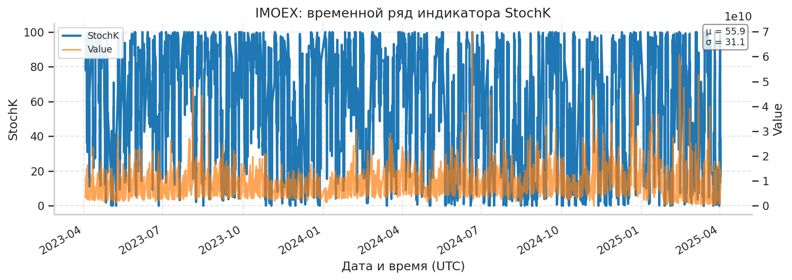

# Отчёт по моделям прогнозирования (почасовые данные)

Версия: автогенерация из артефактов в папке outputs.

## Методология без утечек для IMOEX

Прогнозируем почасовой ряд индекса IMOEX, добавляя экзогенные факторы только в виде лагов. Используемые формулы:

$$r_t = \mu + \beta^\top X_{t-1} + \varepsilon_t, \qquad \sigma_t^2 = \omega + \alpha \varepsilon_{t-1}^2 + \beta \sigma_{t-1}^2 + \gamma^\top X_{t-1}.$$

Вектор $X_{t-1}$ содержит лаги Brent, USD/RUB, ключевой ставки, RSI(50), ATR(50) и лаги цены. Параметры CatBoost/RF и LSTM обучаются только на стандартизованных лаговых матрицах; гибридная LSTM использует прогноз SARIMAX и σ_t из GARCH как признаки риска. Ни один признак не знает будущего, эмбарго и walk-forward разбиения исключают утечки.

## Матрица признаков (Y и Xi)

```
Y=y | X1=Value | X2=SMA_5 | X3=SMA_10 | X4=SMA_20 | X5=EMA_5 | X6=EMA_10 | X7=EMA_20 | X8=BBH | X9=BBL | X10=RSI_50 | X11=StochK | X12=StochD | X13=ATR_50 | X14=OBV | X15=MACD | X16=MACD_SIGNAL | X17=MACD_DIFF | X18=ADX_14 | X19=CCI_20 | X20=ROC_10 | X21=WILLR_14 | X22=lag1 | X23=lag2 | X24=lag3 | X25=lag4 | X26=lag5 | X27=lag6 | X28=lag7 | X29=lag8 | X30=lag9 | X31=lag10 | X32=lag11 | X33=lag12 | X34=lag13 | X35=lag14 | X36=lag15 | X37=lag16 | X38=lag17 | X39=lag18 | X40=lag19 | X41=lag20 | X42=lag21 | X43=lag22 | X44=lag23 | X45=lag24 | X46=lag25 | X47=lag26 | X48=lag27 | X49=lag28 | X50=lag29 | X51=lag30 | X52=lag31 | X53=lag32 | X54=lag33 | X55=lag34 | X56=lag35 | X57=lag36 | X58=lag37 | X59=lag38 | X60=lag39 | X61=lag40 | X62=lag41 | X63=lag42 | X64=lag43 | X65=lag44 | X66=lag45 | X67=lag46 | X68=lag47 | X69=lag48 | X70=lag49 | X71=lag50 | X72=lag51 | X73=lag52 | X74=lag53 | X75=lag54 | X76=lag55 | X77=lag56 | X78=lag57 | X79=lag58 | X80=lag59 | X81=lag60 | X82=Brent_lag1 | X83=Brent_lag2 | X84=Brent_lag3 | X85=Brent_lag4 | X86=Brent_lag5 | X87=Brent_lag6 | X88=Brent_lag7 | X89=Brent_lag8 | X90=Brent_lag9 | X91=Brent_lag10 | X92=Brent_lag11 | X93=Brent_lag12 | X94=Brent_lag13 | X95=Brent_lag14 | X96=Brent_lag15 | X97=Brent_lag16 | X98=Brent_lag17 | X99=Brent_lag18 | X100=Brent_lag19 | X101=Brent_lag20 | X102=Brent_lag21 | X103=Brent_lag22 | X104=Brent_lag23 | X105=Brent_lag24 | X106=USD_lag1 | X107=USD_lag2 | X108=USD_lag3 | X109=USD_lag4 | X110=USD_lag5 | X111=USD_lag6 | X112=USD_lag7 | X113=USD_lag8 | X114=USD_lag9 | X115=USD_lag10 | X116=USD_lag11 | X117=USD_lag12 | X118=USD_lag13 | X119=USD_lag14 | X120=USD_lag15 | X121=USD_lag16 | X122=USD_lag17 | X123=USD_lag18 | X124=USD_lag19 | X125=USD_lag20 | X126=USD_lag21 | X127=USD_lag22 | X128=USD_lag23 | X129=USD_lag24 | X130=KeyRate_lag1 | X131=KeyRate_lag2 | X132=KeyRate_lag3 | X133=KeyRate_lag4 | X134=KeyRate_lag5 | X135=KeyRate_lag6 | X136=KeyRate_lag7 | X137=KeyRate_lag8 | X138=KeyRate_lag9 | X139=KeyRate_lag10 | X140=KeyRate_lag11 | X141=KeyRate_lag12 | X142=KeyRate_lag13 | X143=KeyRate_lag14 | X144=KeyRate_lag15 | X145=KeyRate_lag16 | X146=KeyRate_lag17 | X147=KeyRate_lag18 | X148=KeyRate_lag19 | X149=KeyRate_lag20 | X150=KeyRate_lag21 | X151=KeyRate_lag22 | X152=KeyRate_lag23 | X153=KeyRate_lag24
```

## Сводные метрики по тикерам и моделям

```
   Tk     Model      MAE     RMSE     MASE    CumRet    MaxDD
IMOEX  CatBoost 0.003127 0.004228 0.870724 -0.001007 0.014824
IMOEX  LSTM_att 0.003210 0.004189 0.869474  0.003496 0.013247
IMOEX LSTM_base 0.003294 0.004227 0.886787 -0.002349 0.016028
IMOEX    Hybrid 0.003321 0.004367 0.932904 -0.006724 0.019042
IMOEX     Naive 0.003989 0.005196 1.000000  0.013969 0.007379
IMOEX        RF 0.004165 0.005643 1.328187 -0.012052 0.022998
IMOEX    sNaive 0.005578 0.008291 1.582572 -0.018469 0.025087
IMOEX   SARIMAX 0.008003 0.008885 3.232721 -0.021525 0.023766
```

## Лучшие модели по MAE на тикер

```
   Tk    Model      MAE     RMSE     MASE    CumRet    MaxDD
IMOEX CatBoost 0.003127 0.004228 0.870724 -0.001007 0.014824
```

## Лучшие модели по MASE на тикер

```
   Tk    Model     MAE     RMSE     MASE   CumRet    MaxDD
IMOEX LSTM_att 0.00321 0.004189 0.869474 0.003496 0.013247
```

## Попарные DM-тесты по метрикам

```
   Tk    Model1    Model2 Metric   DM_stat    p_val
IMOEX  CatBoost   SARIMAX    MAE -4.064346 0.000048
IMOEX    Hybrid   SARIMAX    MAE -3.925752 0.000086
IMOEX  LSTM_att   SARIMAX    MAE -3.878342 0.000105
IMOEX LSTM_base   SARIMAX    MAE -3.807648 0.000140
IMOEX        RF   SARIMAX    MAE -3.481422 0.000499
IMOEX  LSTM_att    sNaive    MAE -2.895619 0.003784
IMOEX     Naive   SARIMAX    MAE -2.882875 0.003941
IMOEX  CatBoost    sNaive    MAE -2.862733 0.004200
IMOEX LSTM_base    sNaive    MAE -2.768977 0.005623
IMOEX    Hybrid    sNaive    MAE -2.759288 0.005793
IMOEX  CatBoost        RF    MAE -2.176924 0.029486
IMOEX    Hybrid        RF    MAE -2.032620 0.042091
IMOEX  LSTM_att        RF    MAE -1.901361 0.057255
IMOEX  CatBoost     Naive    MAE -1.795729 0.072538
IMOEX LSTM_base        RF    MAE -1.686296 0.091739
IMOEX     Naive    sNaive    MAE -1.631883 0.102704
IMOEX  LSTM_att     Naive    MAE -1.629068 0.103299
IMOEX   SARIMAX    sNaive    MAE  1.615389 0.106227
IMOEX LSTM_base     Naive    MAE -1.577597 0.114658
IMOEX        RF    sNaive    MAE -1.553729 0.120249
IMOEX    Hybrid     Naive    MAE -1.308758 0.190616
IMOEX  CatBoost    Hybrid    MAE -1.232854 0.217630
IMOEX  CatBoost LSTM_base    MAE -0.973110 0.330498
IMOEX    Hybrid  LSTM_att    MAE  0.676039 0.499016
IMOEX  LSTM_att LSTM_base    MAE -0.606534 0.544160
IMOEX  CatBoost  LSTM_att    MAE -0.521302 0.602156
IMOEX     Naive        RF    MAE -0.245223 0.806283
IMOEX    Hybrid LSTM_base    MAE  0.121592 0.903223
IMOEX  LSTM_att LSTM_base   MAPE -2.499587 0.012434
IMOEX    Hybrid        RF   MAPE -2.468676 0.013561
IMOEX  CatBoost     Naive   MAPE -2.460389 0.013879
IMOEX    Hybrid     Naive   MAPE -2.456602 0.014026
IMOEX     Naive        RF   MAPE  2.141703 0.032217
IMOEX  LSTM_att     Naive   MAPE -2.058004 0.039590
IMOEX  CatBoost LSTM_base   MAPE -2.025847 0.042781
IMOEX    Hybrid LSTM_base   MAPE -2.019525 0.043433
IMOEX  LSTM_att   SARIMAX   MAPE -1.917109 0.055224
IMOEX    Hybrid   SARIMAX   MAPE -1.903481 0.056978
IMOEX  CatBoost   SARIMAX   MAPE -1.899473 0.057502
IMOEX LSTM_base   SARIMAX   MAPE -1.883402 0.059646
IMOEX        RF   SARIMAX   MAPE -1.856511 0.063381
IMOEX  CatBoost    Hybrid   MAPE  1.791024 0.073289
IMOEX    Hybrid    sNaive   MAPE -1.694403 0.090189
IMOEX     Naive   SARIMAX   MAPE -1.690761 0.090882
IMOEX    Hybrid  LSTM_att   MAPE -1.682153 0.092539
IMOEX  CatBoost    sNaive   MAPE -1.572933 0.115734
IMOEX   SARIMAX    sNaive   MAPE  1.523769 0.127567
IMOEX        RF    sNaive   MAPE -1.516539 0.129383
IMOEX LSTM_base        RF   MAPE  1.505736 0.132135
IMOEX  LSTM_att    sNaive   MAPE -1.456887 0.145148
IMOEX  CatBoost  LSTM_att   MAPE -1.404894 0.160053
IMOEX LSTM_base     Naive   MAPE -1.323242 0.185755
IMOEX LSTM_base    sNaive   MAPE -1.221520 0.221889
IMOEX  LSTM_att        RF   MAPE  0.927861 0.353480
IMOEX     Naive    sNaive   MAPE -0.627475 0.530348
IMOEX  CatBoost        RF   MAPE  0.205009 0.837565
IMOEX  LSTM_att LSTM_base  MDAPE -2.499587 0.012434
IMOEX    Hybrid        RF  MDAPE -2.468676 0.013561
IMOEX  CatBoost     Naive  MDAPE -2.460389 0.013879
IMOEX    Hybrid     Naive  MDAPE -2.456602 0.014026
IMOEX     Naive        RF  MDAPE  2.141703 0.032217
IMOEX  LSTM_att     Naive  MDAPE -2.058004 0.039590
IMOEX  CatBoost LSTM_base  MDAPE -2.025847 0.042781
IMOEX    Hybrid LSTM_base  MDAPE -2.019525 0.043433
IMOEX  LSTM_att   SARIMAX  MDAPE -1.917109 0.055224
IMOEX    Hybrid   SARIMAX  MDAPE -1.903481 0.056978
IMOEX  CatBoost   SARIMAX  MDAPE -1.899473 0.057502
IMOEX LSTM_base   SARIMAX  MDAPE -1.883402 0.059646
IMOEX        RF   SARIMAX  MDAPE -1.856511 0.063381
IMOEX  CatBoost    Hybrid  MDAPE  1.791024 0.073289
IMOEX    Hybrid    sNaive  MDAPE -1.694403 0.090189
IMOEX     Naive   SARIMAX  MDAPE -1.690761 0.090882
IMOEX    Hybrid  LSTM_att  MDAPE -1.682153 0.092539
IMOEX  CatBoost    sNaive  MDAPE -1.572933 0.115734
IMOEX   SARIMAX    sNaive  MDAPE  1.523769 0.127567
IMOEX        RF    sNaive  MDAPE -1.516539 0.129383
IMOEX LSTM_base        RF  MDAPE  1.505736 0.132135
IMOEX  LSTM_att    sNaive  MDAPE -1.456887 0.145148
IMOEX  CatBoost  LSTM_att  MDAPE -1.404894 0.160053
IMOEX LSTM_base     Naive  MDAPE -1.323242 0.185755
IMOEX LSTM_base    sNaive  MDAPE -1.221520 0.221889
IMOEX  LSTM_att        RF  MDAPE  0.927861 0.353480
IMOEX     Naive    sNaive  MDAPE -0.627475 0.530348
IMOEX  CatBoost        RF  MDAPE  0.205009 0.837565
IMOEX    Hybrid   SARIMAX   RMSE -3.819007 0.000134
IMOEX  CatBoost   SARIMAX   RMSE -3.812891 0.000137
IMOEX  LSTM_att   SARIMAX   RMSE -3.793766 0.000148
IMOEX LSTM_base   SARIMAX   RMSE -3.749136 0.000177
IMOEX        RF   SARIMAX   RMSE -3.623574 0.000291
IMOEX     Naive   SARIMAX   RMSE -3.328312 0.000874
IMOEX  LSTM_att        RF   RMSE -1.983338 0.047330
IMOEX  LSTM_att     Naive   RMSE -1.964496 0.049473
IMOEX    Hybrid        RF   RMSE -1.960743 0.049909
IMOEX  CatBoost        RF   RMSE -1.954035 0.050697
IMOEX  CatBoost     Naive   RMSE -1.909121 0.056246
IMOEX LSTM_base     Naive   RMSE -1.886888 0.059175
IMOEX LSTM_base        RF   RMSE -1.839878 0.065786
IMOEX  LSTM_att    sNaive   RMSE -1.683836 0.092213
IMOEX    Hybrid     Naive   RMSE -1.682945 0.092386
IMOEX LSTM_base    sNaive   RMSE -1.646436 0.099674
IMOEX  CatBoost    sNaive   RMSE -1.641550 0.100683
IMOEX    Hybrid    sNaive   RMSE -1.637882 0.101446
IMOEX   SARIMAX    sNaive   RMSE  1.458202 0.144785
IMOEX     Naive    sNaive   RMSE -1.299172 0.193885
IMOEX    Hybrid  LSTM_att   RMSE  1.109487 0.267220
IMOEX        RF    sNaive   RMSE -1.081328 0.279551
IMOEX     Naive        RF   RMSE -0.670138 0.502770
IMOEX  LSTM_att LSTM_base   RMSE -0.669215 0.503359
IMOEX  CatBoost    Hybrid   RMSE -0.590204 0.555054
IMOEX  CatBoost  LSTM_att   RMSE  0.444117 0.656958
IMOEX  CatBoost LSTM_base   RMSE -0.304416 0.760811
IMOEX    Hybrid LSTM_base   RMSE  0.238231 0.811702
IMOEX    Hybrid    sNaive  SMAPE  2.608314 0.009099
IMOEX    Hybrid     Naive  SMAPE  2.391046 0.016800
IMOEX        RF    sNaive  SMAPE  2.024715 0.042897
IMOEX     Naive        RF  SMAPE -1.867660 0.061810
IMOEX    Hybrid LSTM_base  SMAPE  1.400594 0.161335
IMOEX  CatBoost    Hybrid  SMAPE -1.372895 0.169785
IMOEX  LSTM_att     Naive  SMAPE  1.342926 0.179296
IMOEX    Hybrid   SARIMAX  SMAPE  1.320809 0.186565
IMOEX   SARIMAX    sNaive  SMAPE  1.281687 0.199952
IMOEX    Hybrid  LSTM_att  SMAPE  1.261981 0.206956
IMOEX  CatBoost    sNaive  SMAPE  1.249736 0.211396
IMOEX     Naive   SARIMAX  SMAPE -1.217453 0.223432
IMOEX  CatBoost     Naive  SMAPE  1.185801 0.235701
IMOEX  LSTM_att    sNaive  SMAPE  1.165148 0.243959
IMOEX LSTM_base     Naive  SMAPE  1.128232 0.259222
IMOEX    Hybrid        RF  SMAPE  1.107205 0.268206
IMOEX LSTM_base    sNaive  SMAPE  1.003635 0.315555
IMOEX LSTM_base        RF  SMAPE -0.707357 0.479344
IMOEX  CatBoost        RF  SMAPE -0.560288 0.575283
IMOEX        RF   SARIMAX  SMAPE  0.504526 0.613892
IMOEX  LSTM_att        RF  SMAPE -0.418513 0.675572
IMOEX  LSTM_att LSTM_base  SMAPE  0.387538 0.698358
IMOEX LSTM_base   SARIMAX  SMAPE -0.227578 0.819974
IMOEX  CatBoost LSTM_base  SMAPE  0.177135 0.859402
IMOEX  CatBoost  LSTM_att  SMAPE -0.137291 0.890801
IMOEX  CatBoost   SARIMAX  SMAPE -0.121757 0.903091
IMOEX     Naive    sNaive  SMAPE -0.075007 0.940209
IMOEX  LSTM_att   SARIMAX  SMAPE  0.020024 0.984024
IMOEX  LSTM_att LSTM_base   WAPE -2.499587 0.012434
IMOEX    Hybrid        RF   WAPE -2.468676 0.013561
IMOEX  CatBoost     Naive   WAPE -2.460389 0.013879
IMOEX    Hybrid     Naive   WAPE -2.456602 0.014026
IMOEX     Naive        RF   WAPE  2.141703 0.032217
IMOEX  LSTM_att     Naive   WAPE -2.058004 0.039590
IMOEX  CatBoost LSTM_base   WAPE -2.025847 0.042781
IMOEX    Hybrid LSTM_base   WAPE -2.019525 0.043433
IMOEX  LSTM_att   SARIMAX   WAPE -1.917109 0.055224
IMOEX    Hybrid   SARIMAX   WAPE -1.903481 0.056978
IMOEX  CatBoost   SARIMAX   WAPE -1.899473 0.057502
IMOEX LSTM_base   SARIMAX   WAPE -1.883402 0.059646
IMOEX        RF   SARIMAX   WAPE -1.856511 0.063381
IMOEX  CatBoost    Hybrid   WAPE  1.791024 0.073289
IMOEX    Hybrid    sNaive   WAPE -1.694403 0.090189
IMOEX     Naive   SARIMAX   WAPE -1.690761 0.090882
IMOEX    Hybrid  LSTM_att   WAPE -1.682153 0.092539
IMOEX  CatBoost    sNaive   WAPE -1.572933 0.115734
IMOEX   SARIMAX    sNaive   WAPE  1.523769 0.127567
IMOEX        RF    sNaive   WAPE -1.516539 0.129383
IMOEX LSTM_base        RF   WAPE  1.505736 0.132135
IMOEX  LSTM_att    sNaive   WAPE -1.456887 0.145148
IMOEX  CatBoost  LSTM_att   WAPE -1.404894 0.160053
IMOEX LSTM_base     Naive   WAPE -1.323242 0.185755
IMOEX LSTM_base    sNaive   WAPE -1.221520 0.221889
IMOEX  LSTM_att        RF   WAPE  0.927861 0.353480
IMOEX     Naive    sNaive   WAPE -0.627475 0.530348
IMOEX  CatBoost        RF   WAPE  0.205009 0.837565
```

## Анализ важности факторов

Средняя значимость признаков усреднена по фолдам и моделям (RF, CatBoost). Список ограничен десятью ключевыми факторами.

```
    Feature  Importance
      Value    0.039595
     RSI_50    0.030673
     ROC_10    0.025669
  MACD_DIFF    0.022913
     CCI_20    0.022492
     StochK    0.021608
MACD_SIGNAL    0.021320
     StochD    0.020703
       MACD    0.019874
     ADX_14    0.017856
```


## Временные ряды топ‑5 индикаторов




## Формулы индикаторов

```
Y (цель): dClose_t = Close_{t+1} − Close_t

Value: денежный оборот за бар (MOEX Value).

SMA_n: SMA_n(t) = mean(Close_{t−n+1..t})  (n ∈ {5,10,20})
EMA_n: EMA_n(t) = α·Close_t + (1−α)·EMA_n(t−1),  α = 2/(n+1)  (n ∈ {5,10,20})

BB (Bollinger, n=20, k=2):
  BBH = SMA_20 + 2·σ_20,   BBL = SMA_20 − 2·σ_20

RSI_50: RSI = 100 − 100/(1 + RS),  RS = EMA(Gain,50)/EMA(Loss,50)

Stochastics (окно n):
  %K = 100·(Close − L_n)/(H_n − L_n),  %D = SMA(%K, 3)
  H_n = max(High_{t−n+1..t}),  L_n = min(Low_{t−n+1..t})

ATR_50: ATR = RMA(TR,50),  TR_t = max(High−Low, |High−Close_{t−1}|, |Low−Close_{t−1}|)

OBV: OBV_t = OBV_{t−1} + sign(Close_t − Close_{t−1})·Volume_t

MACD: MACD = EMA_12(Close) − EMA_26(Close)
MACD_SIGNAL = EMA_9(MACD),  MACD_DIFF = MACD − MACD_SIGNAL

ADX_14: ADX = RMA(DX,14),  DX = 100·|+DI − −DI|/(+DI + −DI)
  +DI, −DI получаются из +DM, −DM и TR по схеме Уайлдера

CCI_20: CCI = (TP − SMA(TP,20)) / (0.015·MD_20),  TP=(H+L+C)/3,
  MD_20 = mean(|TP − SMA(TP,20)|) за 20 баров

ROC_10: ROC = 100·(Close_t/Close_{t−10} − 1)
WILLR_14: −100·(H_14 − Close)/(H_14 − L_14)

Лаги цены: lag_k = Close_{t−k},  k = 1..60
Лаги экзогенных факторов: Brent_lag_k, USD_lag_k, KeyRate_lag_k = соответствующий уровень на t−k,  k = 1..24
```

## Цепной анализ IMOEX

Сводка по месячным цепным приращениям (фрагмент):

```
  begin   Close  ChainIncrement  MeanRelGrowthPct  Volatility
2023-04 2634.94          161.62          0.335760   16.917286
2023-05 2717.64           82.70          0.153121   28.977109
2023-06 2797.37           79.73          0.140222   19.680076
2023-07 3073.50          276.13          0.451548   20.423911
2023-08 3227.99          154.49          0.217799   29.678795
2023-09 3133.26          -94.73         -0.136964   31.479178
2023-10 3200.97           67.71          0.098700   17.818449
2023-11 3165.79          -35.18         -0.049107   15.525597
2023-12 3099.11          -66.68         -0.098335   24.368236
2024-01 3214.19          115.08          0.174412   11.553472
2024-02 3256.80           42.61          0.069252   26.942123
2024-03 3332.53           75.73          0.115965   14.845580
```

Дневные цепные приросты (фрагмент):

```
                     Date   Close  ChainIncrement  ChainGrowthCoef  RelativeGrowth  RelativeGrowthPct  ChainIndex  BaseAbsolute  BaseRelativeCoef  BaseRelativePct  ChainAbsoluteIndex  ChainRelativeIndex  StructuralShiftAbsolute  StructuralShiftRelativePct
2023-04-04 00:00:00+00:00 2480.45            7.13         1.002883        0.002883           0.288276    1.002883          7.13          1.002883         0.288276                7.13            1.002883                     7.13                    0.288276
2023-04-05 00:00:00+00:00 2500.80           20.35         1.008204        0.008204           0.820416    1.011111         27.48          1.011111         1.111057               20.35            1.008204                    20.35                    0.820416
2023-04-06 00:00:00+00:00 2498.30           -2.50         0.999000       -0.001000          -0.099968    1.010100         24.98          1.010100         1.009978               -2.50            0.999000                    -2.50                   -0.099968
2023-04-07 00:00:00+00:00 2508.39           10.09         1.004039        0.004039           0.403875    1.014179         35.07          1.014179         1.417932               10.09            1.004039                    10.09                    0.403875
2023-04-10 00:00:00+00:00 2547.35           38.96         1.015532        0.015532           1.553188    1.029931         74.03          1.029931         2.993143               38.96            1.015532                    38.96                    1.553188
2023-04-11 00:00:00+00:00 2533.69          -13.66         0.994638       -0.005362          -0.536244    1.024408         60.37          1.024408         2.440849              -13.66            0.994638                   -13.66                   -0.536244
2023-04-12 00:00:00+00:00 2538.47            4.78         1.001887        0.001887           0.188658    1.026341         65.15          1.026341         2.634111                4.78            1.001887                     4.78                    0.188658
2023-04-13 00:00:00+00:00 2544.28            5.81         1.002289        0.002289           0.228878    1.028690         70.96          1.028690         2.869018                5.81            1.002289                     5.81                    0.228878
2023-04-14 00:00:00+00:00 2554.85           10.57         1.004154        0.004154           0.415442    1.032964         81.53          1.032964         3.296379               10.57            1.004154                    10.57                    0.415442
2023-04-17 00:00:00+00:00 2596.11           41.26         1.016150        0.016150           1.614968    1.049646        122.79          1.049646         4.964582               41.26            1.016150                    41.26                    1.614968
2023-04-18 00:00:00+00:00 2615.62           19.51         1.007515        0.007515           0.751509    1.057534        142.30          1.057534         5.753400               19.51            1.007515                    19.51                    0.751509
2023-04-19 00:00:00+00:00 2606.55           -9.07         0.996532       -0.003468          -0.346763    1.053867        133.23          1.053867         5.386687               -9.07            0.996532                    -9.07                   -0.346763
```

Файл включает цепные/базисные относительные и абсолютные индексы и коэффициент структурного сдвига.

Ключевые показатели цепного роста:

```
                   Metric     Value
       mean_abs_increment 24.506464
        median_growth_pct  0.094832
           max_growth_pct  9.185789
           min_growth_pct -3.971219
mean_structural_shift_pct  0.836874
```


## Примеры графиков

Графики факта/прогнозов, ACF остатков, гистограммы и кривые капитала — см. папку `outputs/reports/`.


## Факт и прогноз на всём горизонте (все фолды)


## Кластеризация режимов по тикерам

```
   Tk  k  silhouette  n_points
IMOEX  5    0.259297      4585
```


