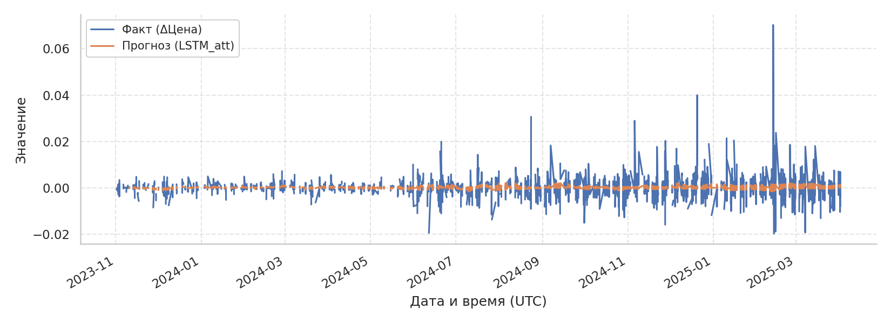
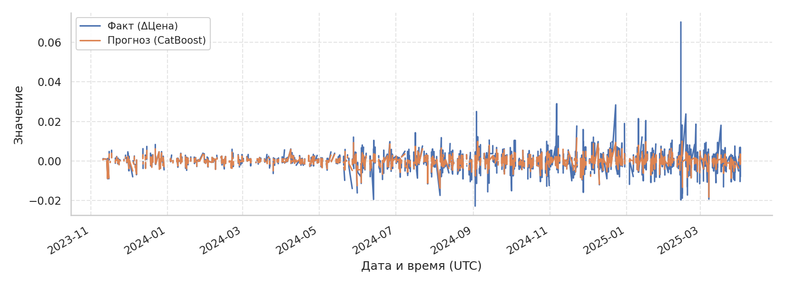
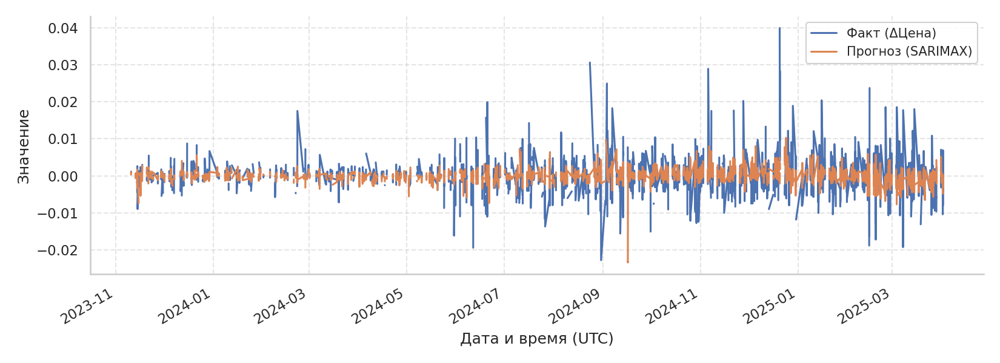

# Отчёт по моделям прогнозирования (почасовые данные)

Версия: автогенерация из артефактов в папке outputs.

## Методология без утечек для IMOEX

Прогнозируем почасовой ряд индекса IMOEX, добавляя экзогенные факторы только в виде лагов. Используемые формулы:

$$r_t = \mu + \beta^\top X_{t-1} + \varepsilon_t, \qquad \sigma_t^2 = \omega + \alpha \varepsilon_{t-1}^2 + \beta \sigma_{t-1}^2 + \gamma^\top X_{t-1}.$$

Вектор $X_{t-1}$ содержит лаги Brent, USD/RUB, ключевой ставки, RSI(50), ATR(50) и лаги цены. Параметры CatBoost/RF и LSTM обучаются только на стандартизованных лаговых матрицах; гибридная LSTM использует прогноз SARIMAX и σ_t из GARCH как признаки риска. Ни один признак не знает будущего, эмбарго и walk-forward разбиения исключают утечки.

## Матрица признаков (Y и Xi)

```
Y=y | X1=Value | X2=SMA_5 | X3=SMA_10 | X4=SMA_20 | X5=EMA_5 | X6=EMA_10 | X7=EMA_20 | X8=BBH | X9=BBL | X10=RSI_50 | X11=StochK | X12=StochD | X13=ATR_50 | X14=OBV | X15=MACD | X16=MACD_SIGNAL | X17=MACD_DIFF | X18=ADX_14 | X19=CCI_20 | X20=ROC_10 | X21=WILLR_14 | X22=lag1 | X23=lag2 | X24=lag3 | X25=lag4 | X26=lag5 | X27=lag6 | X28=lag7 | X29=lag8 | X30=lag9 | X31=lag10 | X32=lag11 | X33=lag12 | X34=lag13 | X35=lag14 | X36=lag15 | X37=lag16 | X38=lag17 | X39=lag18 | X40=lag19 | X41=lag20 | X42=lag21 | X43=lag22 | X44=lag23 | X45=lag24 | X46=lag25 | X47=lag26 | X48=lag27 | X49=lag28 | X50=lag29 | X51=lag30 | X52=lag31 | X53=lag32 | X54=lag33 | X55=lag34 | X56=lag35 | X57=lag36 | X58=lag37 | X59=lag38 | X60=lag39 | X61=lag40 | X62=lag41 | X63=lag42 | X64=lag43 | X65=lag44 | X66=lag45 | X67=lag46 | X68=lag47 | X69=lag48 | X70=lag49 | X71=lag50 | X72=lag51 | X73=lag52 | X74=lag53 | X75=lag54 | X76=lag55 | X77=lag56 | X78=lag57 | X79=lag58 | X80=lag59 | X81=lag60 | X82=Brent_lag1 | X83=Brent_lag2 | X84=Brent_lag3 | X85=Brent_lag4 | X86=Brent_lag5 | X87=Brent_lag6 | X88=Brent_lag7 | X89=Brent_lag8 | X90=Brent_lag9 | X91=Brent_lag10 | X92=Brent_lag11 | X93=Brent_lag12 | X94=Brent_lag13 | X95=Brent_lag14 | X96=Brent_lag15 | X97=Brent_lag16 | X98=Brent_lag17 | X99=Brent_lag18 | X100=Brent_lag19 | X101=Brent_lag20 | X102=Brent_lag21 | X103=Brent_lag22 | X104=Brent_lag23 | X105=Brent_lag24 | X106=USD_lag1 | X107=USD_lag2 | X108=USD_lag3 | X109=USD_lag4 | X110=USD_lag5 | X111=USD_lag6 | X112=USD_lag7 | X113=USD_lag8 | X114=USD_lag9 | X115=USD_lag10 | X116=USD_lag11 | X117=USD_lag12 | X118=USD_lag13 | X119=USD_lag14 | X120=USD_lag15 | X121=USD_lag16 | X122=USD_lag17 | X123=USD_lag18 | X124=USD_lag19 | X125=USD_lag20 | X126=USD_lag21 | X127=USD_lag22 | X128=USD_lag23 | X129=USD_lag24
```

## Сводные метрики по тикерам и моделям

```
   Tk     Model      MAE     RMSE     MASE    CumRet    MaxDD
IMOEX LSTM_base 0.003327 0.004616 0.713640 -0.005809 0.015423
IMOEX    Hybrid 0.003341 0.004529 0.673610 -0.002862 0.013580
IMOEX  CatBoost 0.003398 0.004630 0.816719 -0.015841 0.019143
IMOEX  LSTM_att 0.003429 0.004650 0.783551 -0.008133 0.016650
IMOEX   SARIMAX 0.003478 0.004721 0.831859 -0.011846 0.021198
IMOEX        RF 0.003892 0.004896 0.890258  0.001843 0.011555
IMOEX    sNaive 0.004481 0.006201 1.030222 -0.011021 0.019217
IMOEX     Naive 0.005182 0.006812 1.000000  0.012547 0.006466
```

## Лучшие модели по MAE на тикер

```
   Tk     Model      MAE     RMSE    MASE    CumRet    MaxDD
IMOEX LSTM_base 0.003327 0.004616 0.71364 -0.005809 0.015423
```

## Лучшие модели по MASE на тикер

```
   Tk  Model      MAE     RMSE    MASE    CumRet   MaxDD
IMOEX Hybrid 0.003341 0.004529 0.67361 -0.002862 0.01358
```

## Попарные DM-тесты по метрикам

```
   Tk    Model1    Model2 Metric   DM_stat    p_val
IMOEX    Hybrid     Naive    MAE -3.512399 0.000444
IMOEX LSTM_base     Naive    MAE -3.323216 0.000890
IMOEX  LSTM_att     Naive    MAE -3.241652 0.001188
IMOEX     Naive   SARIMAX    MAE  3.138987 0.001695
IMOEX  CatBoost     Naive    MAE -3.111079 0.001864
IMOEX    Hybrid    sNaive    MAE -2.596702 0.009412
IMOEX LSTM_base    sNaive    MAE -2.586294 0.009701
IMOEX  CatBoost    sNaive    MAE -2.487424 0.012867
IMOEX     Naive        RF    MAE  2.360746 0.018238
IMOEX  LSTM_att    sNaive    MAE -2.315870 0.020565
IMOEX   SARIMAX    sNaive    MAE -2.204002 0.027524
IMOEX    Hybrid        RF    MAE -1.902678 0.057083
IMOEX LSTM_base        RF    MAE -1.652808 0.098370
IMOEX  CatBoost        RF    MAE -1.493704 0.135253
IMOEX  LSTM_att        RF    MAE -1.487908 0.136775
IMOEX        RF   SARIMAX    MAE  1.470601 0.141399
IMOEX        RF    sNaive    MAE -1.406285 0.159639
IMOEX     Naive    sNaive    MAE  1.059330 0.289449
IMOEX  LSTM_att LSTM_base    MAE  0.956756 0.338690
IMOEX LSTM_base   SARIMAX    MAE -0.879645 0.379052
IMOEX    Hybrid   SARIMAX    MAE -0.736890 0.461189
IMOEX    Hybrid  LSTM_att    MAE -0.627025 0.530643
IMOEX  CatBoost   SARIMAX    MAE -0.416100 0.677337
IMOEX  CatBoost LSTM_base    MAE  0.376941 0.706217
IMOEX  LSTM_att   SARIMAX    MAE -0.329068 0.742104
IMOEX  CatBoost    Hybrid    MAE  0.275151 0.783200
IMOEX  CatBoost  LSTM_att    MAE -0.197357 0.843548
IMOEX    Hybrid LSTM_base    MAE  0.071446 0.943043
IMOEX    Hybrid    sNaive   MAPE -3.120550 0.001805
IMOEX LSTM_base     Naive   MAPE -3.075862 0.002099
IMOEX  LSTM_att     Naive   MAPE -2.987121 0.002816
IMOEX  CatBoost     Naive   MAPE -2.871710 0.004083
IMOEX    Hybrid        RF   MAPE -2.855281 0.004300
IMOEX  CatBoost    sNaive   MAPE -2.771165 0.005586
IMOEX    Hybrid     Naive   MAPE -2.743538 0.006078
IMOEX  LSTM_att    sNaive   MAPE -2.702490 0.006882
IMOEX LSTM_base    sNaive   MAPE -2.658936 0.007839
IMOEX  CatBoost        RF   MAPE -2.628136 0.008585
IMOEX  LSTM_att        RF   MAPE -2.489949 0.012776
IMOEX LSTM_base        RF   MAPE -2.485055 0.012953
IMOEX     Naive   SARIMAX   MAPE  2.387955 0.016942
IMOEX        RF    sNaive   MAPE -2.169094 0.030076
IMOEX   SARIMAX    sNaive   MAPE -2.090316 0.036589
IMOEX        RF   SARIMAX   MAPE  1.377658 0.168309
IMOEX LSTM_base   SARIMAX   MAPE -1.203000 0.228976
IMOEX     Naive    sNaive   MAPE -1.161156 0.245578
IMOEX  CatBoost LSTM_base   MAPE  1.154117 0.248452
IMOEX  LSTM_att   SARIMAX   MAPE -1.146500 0.251588
IMOEX  CatBoost  LSTM_att   MAPE  1.117675 0.263706
IMOEX    Hybrid   SARIMAX   MAPE -0.868468 0.385138
IMOEX  LSTM_att LSTM_base   MAPE  0.807500 0.419378
IMOEX  CatBoost   SARIMAX   MAPE -0.748573 0.454115
IMOEX    Hybrid LSTM_base   MAPE  0.658309 0.510339
IMOEX  CatBoost    Hybrid   MAPE  0.599760 0.548666
IMOEX    Hybrid  LSTM_att   MAPE  0.376606 0.706466
IMOEX     Naive        RF   MAPE  0.188532 0.850459
IMOEX    Hybrid    sNaive  MDAPE -3.120550 0.001805
IMOEX LSTM_base     Naive  MDAPE -3.075862 0.002099
IMOEX  LSTM_att     Naive  MDAPE -2.987121 0.002816
IMOEX  CatBoost     Naive  MDAPE -2.871710 0.004083
IMOEX    Hybrid        RF  MDAPE -2.855281 0.004300
IMOEX  CatBoost    sNaive  MDAPE -2.771165 0.005586
IMOEX    Hybrid     Naive  MDAPE -2.743538 0.006078
IMOEX  LSTM_att    sNaive  MDAPE -2.702490 0.006882
IMOEX LSTM_base    sNaive  MDAPE -2.658936 0.007839
IMOEX  CatBoost        RF  MDAPE -2.628136 0.008585
IMOEX  LSTM_att        RF  MDAPE -2.489949 0.012776
IMOEX LSTM_base        RF  MDAPE -2.485055 0.012953
IMOEX     Naive   SARIMAX  MDAPE  2.387955 0.016942
IMOEX        RF    sNaive  MDAPE -2.169094 0.030076
IMOEX   SARIMAX    sNaive  MDAPE -2.090316 0.036589
IMOEX        RF   SARIMAX  MDAPE  1.377658 0.168309
IMOEX LSTM_base   SARIMAX  MDAPE -1.203000 0.228976
IMOEX     Naive    sNaive  MDAPE -1.161156 0.245578
IMOEX  CatBoost LSTM_base  MDAPE  1.154117 0.248452
IMOEX  LSTM_att   SARIMAX  MDAPE -1.146500 0.251588
IMOEX  CatBoost  LSTM_att  MDAPE  1.117675 0.263706
IMOEX    Hybrid   SARIMAX  MDAPE -0.868468 0.385138
IMOEX  LSTM_att LSTM_base  MDAPE  0.807500 0.419378
IMOEX  CatBoost   SARIMAX  MDAPE -0.748573 0.454115
IMOEX    Hybrid LSTM_base  MDAPE  0.658309 0.510339
IMOEX  CatBoost    Hybrid  MDAPE  0.599760 0.548666
IMOEX    Hybrid  LSTM_att  MDAPE  0.376606 0.706466
IMOEX     Naive        RF  MDAPE  0.188532 0.850459
IMOEX    Hybrid     Naive   RMSE -2.502320 0.012338
IMOEX  LSTM_att     Naive   RMSE -2.412427 0.015847
IMOEX     Naive   SARIMAX   RMSE  2.410834 0.015916
IMOEX  CatBoost     Naive   RMSE -2.408819 0.016004
IMOEX     Naive        RF   RMSE  2.340122 0.019277
IMOEX LSTM_base     Naive   RMSE -2.337340 0.019422
IMOEX LSTM_base    sNaive   RMSE -2.089030 0.036705
IMOEX  CatBoost    sNaive   RMSE -2.036202 0.041730
IMOEX  LSTM_att    sNaive   RMSE -1.951760 0.050967
IMOEX   SARIMAX    sNaive   RMSE -1.950741 0.051088
IMOEX    Hybrid    sNaive   RMSE -1.816198 0.069340
IMOEX        RF    sNaive   RMSE -1.571757 0.116007
IMOEX  CatBoost        RF   RMSE -0.888186 0.374441
IMOEX    Hybrid        RF   RMSE -0.873422 0.382433
IMOEX        RF   SARIMAX   RMSE  0.780486 0.435105
IMOEX  LSTM_att        RF   RMSE -0.771242 0.440563
IMOEX     Naive    sNaive   RMSE  0.649619 0.515938
IMOEX LSTM_base        RF   RMSE -0.626762 0.530815
IMOEX  CatBoost   SARIMAX   RMSE -0.561486 0.574466
IMOEX  CatBoost LSTM_base   RMSE -0.502158 0.615557
IMOEX  CatBoost  LSTM_att   RMSE -0.488287 0.625347
IMOEX    Hybrid   SARIMAX   RMSE -0.208404 0.834914
IMOEX  CatBoost    Hybrid   RMSE -0.194764 0.845577
IMOEX    Hybrid LSTM_base   RMSE -0.175092 0.861007
IMOEX  LSTM_att LSTM_base   RMSE -0.161638 0.871591
IMOEX    Hybrid  LSTM_att   RMSE -0.159697 0.873120
IMOEX  LSTM_att   SARIMAX   RMSE -0.118728 0.905491
IMOEX LSTM_base   SARIMAX   RMSE  0.041453 0.966935
IMOEX    Hybrid  LSTM_att  SMAPE -3.466357 0.000528
IMOEX  LSTM_att LSTM_base  SMAPE  3.175672 0.001495
IMOEX  LSTM_att    sNaive  SMAPE  2.322907 0.020184
IMOEX  LSTM_att     Naive  SMAPE  2.231791 0.025629
IMOEX    Hybrid        RF  SMAPE -1.966016 0.049297
IMOEX    Hybrid   SARIMAX  SMAPE -1.903614 0.056960
IMOEX  CatBoost  LSTM_att  SMAPE -1.749463 0.080211
IMOEX  CatBoost    Hybrid  SMAPE  1.468465 0.141978
IMOEX  LSTM_att   SARIMAX  SMAPE  1.347565 0.177798
IMOEX        RF    sNaive  SMAPE  1.337473 0.181068
IMOEX   SARIMAX    sNaive  SMAPE  1.291866 0.196403
IMOEX LSTM_base   SARIMAX  SMAPE -1.179813 0.238075
IMOEX  LSTM_att        RF  SMAPE  1.098716 0.271892
IMOEX     Naive   SARIMAX  SMAPE -1.089245 0.276046
IMOEX     Naive        RF  SMAPE -1.017402 0.308962
IMOEX    Hybrid     Naive  SMAPE -0.984847 0.324699
IMOEX LSTM_base        RF  SMAPE -0.981846 0.326176
IMOEX  CatBoost LSTM_base  SMAPE  0.963023 0.335536
IMOEX  CatBoost    sNaive  SMAPE  0.926325 0.354277
IMOEX    Hybrid LSTM_base  SMAPE -0.854868 0.392624
IMOEX    Hybrid    sNaive  SMAPE -0.759981 0.447266
IMOEX  CatBoost     Naive  SMAPE  0.721756 0.470445
IMOEX  CatBoost        RF  SMAPE -0.285846 0.774996
IMOEX  CatBoost   SARIMAX  SMAPE -0.220802 0.825247
IMOEX     Naive    sNaive  SMAPE  0.167022 0.867352
IMOEX LSTM_base     Naive  SMAPE -0.118720 0.905497
IMOEX        RF   SARIMAX  SMAPE  0.048649 0.961199
IMOEX LSTM_base    sNaive  SMAPE  0.017445 0.986082
IMOEX    Hybrid    sNaive   WAPE -3.120550 0.001805
IMOEX LSTM_base     Naive   WAPE -3.075862 0.002099
IMOEX  LSTM_att     Naive   WAPE -2.987121 0.002816
IMOEX  CatBoost     Naive   WAPE -2.871710 0.004083
IMOEX    Hybrid        RF   WAPE -2.855281 0.004300
IMOEX  CatBoost    sNaive   WAPE -2.771165 0.005586
IMOEX    Hybrid     Naive   WAPE -2.743538 0.006078
IMOEX  LSTM_att    sNaive   WAPE -2.702490 0.006882
IMOEX LSTM_base    sNaive   WAPE -2.658936 0.007839
IMOEX  CatBoost        RF   WAPE -2.628136 0.008585
IMOEX  LSTM_att        RF   WAPE -2.489949 0.012776
IMOEX LSTM_base        RF   WAPE -2.485055 0.012953
IMOEX     Naive   SARIMAX   WAPE  2.387955 0.016942
IMOEX        RF    sNaive   WAPE -2.169094 0.030076
IMOEX   SARIMAX    sNaive   WAPE -2.090316 0.036589
IMOEX        RF   SARIMAX   WAPE  1.377658 0.168309
IMOEX LSTM_base   SARIMAX   WAPE -1.203000 0.228976
IMOEX     Naive    sNaive   WAPE -1.161156 0.245578
IMOEX  CatBoost LSTM_base   WAPE  1.154117 0.248452
IMOEX  LSTM_att   SARIMAX   WAPE -1.146500 0.251588
IMOEX  CatBoost  LSTM_att   WAPE  1.117675 0.263706
IMOEX    Hybrid   SARIMAX   WAPE -0.868468 0.385138
IMOEX  LSTM_att LSTM_base   WAPE  0.807500 0.419378
IMOEX  CatBoost   SARIMAX   WAPE -0.748573 0.454115
IMOEX    Hybrid LSTM_base   WAPE  0.658309 0.510339
IMOEX  CatBoost    Hybrid   WAPE  0.599760 0.548666
IMOEX    Hybrid  LSTM_att   WAPE  0.376606 0.706466
IMOEX     Naive        RF   WAPE  0.188532 0.850459
```

## Анализ важности факторов

Средняя значимость признаков усреднена по фолдам и моделям (RF, CatBoost). Список ограничен десятью ключевыми факторами.

```
  Feature  Importance
    Value    0.038746
   RSI_50    0.034363
   ROC_10    0.032063
MACD_DIFF    0.023936
   StochD    0.023759
 WILLR_14    0.022221
   CCI_20    0.021787
     MACD    0.020545
   StochK    0.019444
   ATR_50    0.018533
```


## Временные ряды топ‑5 индикаторов


## Формулы индикаторов

```
Y (цель): dClose_t = Close_{t+1} − Close_t

Value: денежный оборот за бар (MOEX Value).

SMA_n: SMA_n(t) = mean(Close_{t−n+1..t})  (n ∈ {5,10,20})
EMA_n: EMA_n(t) = α·Close_t + (1−α)·EMA_n(t−1),  α = 2/(n+1)  (n ∈ {5,10,20})

BB (Bollinger, n=20, k=2):
  BBH = SMA_20 + 2·σ_20,   BBL = SMA_20 − 2·σ_20

RSI_50: RSI = 100 − 100/(1 + RS),  RS = EMA(Gain,50)/EMA(Loss,50)

Stochastics (окно n):
  %K = 100·(Close − L_n)/(H_n − L_n),  %D = SMA(%K, 3)
  H_n = max(High_{t−n+1..t}),  L_n = min(Low_{t−n+1..t})

ATR_50: ATR = RMA(TR,50),  TR_t = max(High−Low, |High−Close_{t−1}|, |Low−Close_{t−1}|)

OBV: OBV_t = OBV_{t−1} + sign(Close_t − Close_{t−1})·Volume_t

MACD: MACD = EMA_12(Close) − EMA_26(Close)
MACD_SIGNAL = EMA_9(MACD),  MACD_DIFF = MACD − MACD_SIGNAL

ADX_14: ADX = RMA(DX,14),  DX = 100·|+DI − −DI|/(+DI + −DI)
  +DI, −DI получаются из +DM, −DM и TR по схеме Уайлдера

CCI_20: CCI = (TP − SMA(TP,20)) / (0.015·MD_20),  TP=(H+L+C)/3,
  MD_20 = mean(|TP − SMA(TP,20)|) за 20 баров

ROC_10: ROC = 100·(Close_t/Close_{t−10} − 1)
WILLR_14: −100·(H_14 − Close)/(H_14 − L_14)

Лаги цены: lag_k = Close_{t−k},  k = 1..60
Лаги экзогенных факторов: Brent_lag_k, USD_lag_k, KeyRate_lag_k = соответствующий уровень на t−k,  k = 1..24
```

## Цепной анализ IMOEX

Сводка по месячным цепным приращениям (фрагмент):

```
  begin   Close  ChainIncrement  MeanRelGrowthPct  Volatility
2023-10 3200.97          -26.10         -0.808783         NaN
2023-11 3165.79          -35.18         -0.049107   15.525597
2023-12 3099.11          -66.68         -0.098335   24.368236
2024-01 3214.19          115.08          0.174412   11.553472
2024-02 3256.80           42.61          0.069252   26.942123
2024-03 3332.53           75.73          0.115965   14.845580
2024-04 3469.83          137.30          0.176723   15.905302
2024-05 3217.19         -252.64         -0.355336   30.897251
2024-06 3154.36          -62.83         -0.093060   47.056312
2024-07 2942.68         -211.68         -0.292823   41.044346
2024-08 2650.32         -292.36         -0.464896   39.177986
2024-09 2857.56          207.24          0.373861   46.640322
```

Дневные цепные приросты (фрагмент):

```
                     Date   Close  ChainIncrement  ChainGrowthCoef  RelativeGrowth  RelativeGrowthPct  ChainIndex  BaseAbsolute  BaseRelativeCoef  BaseRelativePct  ChainAbsoluteIndex  ChainRelativeIndex  StructuralShiftAbsolute  StructuralShiftRelativePct
2023-10-31 00:00:00+00:00 3200.97          -26.10         0.991912       -0.008088          -0.808783    0.991912        -26.10          0.991912        -0.808783              -26.10            0.991912                   -26.10                   -0.808783
2023-11-01 00:00:00+00:00 3206.52            5.55         1.001734        0.001734           0.173385    0.993632        -20.55          0.993632        -0.636801                5.55            1.001734                     5.55                    0.173385
2023-11-02 00:00:00+00:00 3197.22           -9.30         0.997100       -0.002900          -0.290034    0.990750        -29.85          0.990750        -0.924988               -9.30            0.997100                    -9.30                   -0.290034
2023-11-03 00:00:00+00:00 3208.63           11.41         1.003569        0.003569           0.356873    0.994286        -18.44          0.994286        -0.571416               11.41            1.003569                    11.41                    0.356873
2023-11-06 00:00:00+00:00 3235.11           26.48         1.008253        0.008253           0.825274    1.002491          8.04          1.002491         0.249142               26.48            1.008253                    26.48                    0.825274
2023-11-07 00:00:00+00:00 3246.34           11.23         1.003471        0.003471           0.347129    1.005971         19.27          1.005971         0.597136               11.23            1.003471                    11.23                    0.347129
2023-11-08 00:00:00+00:00 3245.43           -0.91         0.999720       -0.000280          -0.028032    1.005689         18.36          1.005689         0.568937               -0.91            0.999720                    -0.91                   -0.028032
2023-11-09 00:00:00+00:00 3239.92           -5.51         0.998302       -0.001698          -0.169777    1.003982         12.85          1.003982         0.398194               -5.51            0.998302                    -5.51                   -0.169777
2023-11-10 00:00:00+00:00 3242.06            2.14         1.000661        0.000661           0.066051    1.004645         14.99          1.004645         0.464508                2.14            1.000661                     2.14                    0.066051
2023-11-13 00:00:00+00:00 3248.27            6.21         1.001915        0.001915           0.191545    1.006569         21.20          1.006569         0.656943                6.21            1.001915                     6.21                    0.191545
2023-11-14 00:00:00+00:00 3212.39          -35.88         0.988954       -0.011046          -1.104588    0.995451        -14.68          0.995451        -0.454902              -35.88            0.988954                   -35.88                   -1.104588
2023-11-15 00:00:00+00:00 3215.11            2.72         1.000847        0.000847           0.084672    0.996294        -11.96          0.996294        -0.370615                2.72            1.000847                     2.72                    0.084672
```

Файл включает цепные/базисные относительные и абсолютные индексы и коэффициент структурного сдвига.

Ключевые показатели цепного роста:

```
                   Metric     Value
       mean_abs_increment 26.765967
        median_growth_pct  0.066402
           max_growth_pct  9.185789
           min_growth_pct -3.971219
mean_structural_shift_pct  0.911423
```


## Примеры графиков

Графики факта/прогнозов, ACF остатков, гистограммы и кривые капитала — см. папку `outputs/reports/`.


## Факт и прогноз на всём горизонте (все фолды)








## Кластеризация режимов по тикерам

```
   Tk  k  silhouette  n_points
IMOEX  5    0.318751      3262
```


